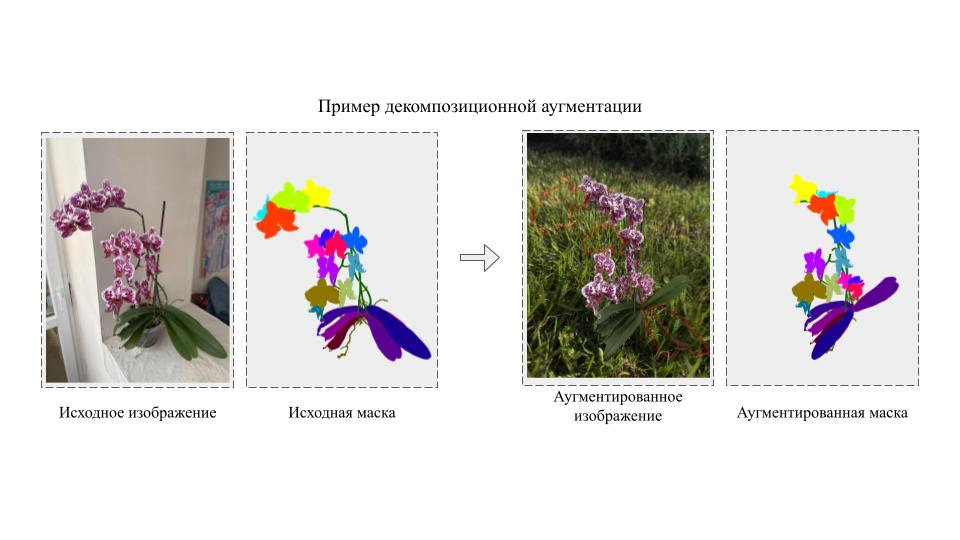
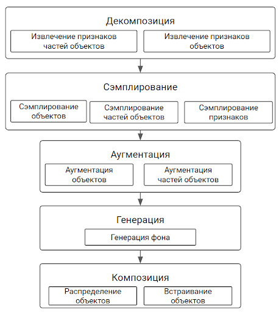

# Библиотека для декомпозиционной аугментации мультимодальных изображений

Библиотека реализует аугментацию изображений с возможностью управления составными частями объектов. Выполнено в рамках гранда Код ИИ.




Данная библиотека работает с изображениями составных объектов, для которых есть сегментационная маска каждого подобъекта. Из масок извлекаются признаки, на основе которых можно понимать о взаимоотношении разных частей объектов. На основе этой информации сэмплируются новые части объектов и их координаты. Объекты и/или их части аугментируются отдельно, после чего собираются в новое изображение. При необходимости можно сгенерировать новый фон или же взять существующий.




## Запуск библиотеки

Возможны несколько вариантов запуска:

### Запуск без локальной установки на ресурсах Google Colab (рекомендованный способ для ознакомления с функционалом)

Использование Google Colab - это самый простой способ ознакомиться с функционалом библиотеки. Для настройки и использования библиотеки в Google Colab, воспользуйтесь подготовленным ноутбуком с примерами:

[](https://colab.research.google.com/drive/1SQzDHct0G3PFxmuEgeMV3EVx31xickep?usp=sharing) 

В colab будет достаточно выполнить команды:
```python
!git clone https://github.com/nesterus/mpia.git

import sys
sys.path.append('./mpia')

%cd mpia

!pip install -r requirements.txt
```


Ноутбук с примером предобработки данных через Google Colab:

[](https://colab.research.google.com/drive/1nyRjj-4mzZlKkGybkQFLpsH7D6twptpV?usp=sharing)


### Запуск с помощью Docker

<details>

Перед началом работы с помощью Docker, убедитесь в доступности cudnn в Docker на вашей системе. Для этого выполните в терминале:

```bash
docker run --gpus all nvidia/cuda:12.0.1-cudnn8-runtime-ubuntu22.04 nvidia-smi
```

Если в результате вы увидите таблицу с характеристиками вашей ГПУ, то можно работать дальше. Иначе, настройте Docker по [инструкции](https://medium.com/@christoph.schranz/set-up-your-own-gpu-based-jupyterlab-e0d45fcacf43). 


Для запуска с CUDA:12 и совместимыми можно использовать готовый Docker образ:

```bash
docker pull nesterus/mpia:v1

docker run --gpus all -d -it -p 8888:8888 -v $(pwd)/data:/home/jovyan/work -e GRANT_SUDO=yes -e JUPYTER_ENABLE_LAB=yes --user root nesterus/mpia:v1

docker exec -it [container-ID] jupyter server list
```

где *[container-ID]* - это идентификатор контейнера Docker, который будет написан в терминале в результате выполнение предыдущей команды. 

После запуска, необходимо открыть в браузере [локальный адрес (localhost)](http://localhost:8888). В открывшемся окне необходимо указато токен авторизации, который появится в терминале в результате выполнение предыдущей команды. 

В открывшемся окне будет работать Jupyter Lab. Для начала рекомендуется обновить репозиторий. Для этого откройте терминал внутри Jupyter Lab, и выполните команду `git pull`. Далее можете начать работу с ноутбука *pipeline_modes.ipynb*. Если вы не знакомы с Jupyter Lab, узнать больше можно в [официальной документации Jupyter Lab](https://docs.jupyter.org/en/latest/start/index.html). 


При использовании других версий CUDA, можно собрать Docker образ самостоятельно на основе текущего. Для этого замените источник в первой строке следующего примера Dockerfile на подходящий из данного [списка базовых образов](https://hub.docker.com/r/cschranz/gpu-jupyter/tags). 

```Dockerfile
FROM cschranz/gpu-jupyter:v1.5_cuda-12.0_ubuntu-22.04_python-only

RUN git clone https://github.com/nesterus/mpia.git
WORKDIR ./mpia

RUN pip install --no-cache-dir -r requirements.txt 
```

С инструкцией по сборке образов и их дальнейшему использованию можно ознакомиться в [официальной документации Docker](https://docs.docker.com/engine/reference/commandline/build/). 

</details>


### Запуск с помощью pip

<details>

Если на вашей системе не установлен Python, сначала выполните в терминале команды:

```bash
sudo apt update && sudo apt upgrade -y
sudo apt install python3.11 -y
sudo apt install python3-pip -y
sudo apt install python3.11-venv -y
sudo apt install cmake -y
```
Или скачайте и установите Python вручную на [официальном сайте Python](https://www.python.org/downloads/).
Библиотека протестирована на Python версии 3.9, 3.10 и 3.11. Если установлен Python версии ниже 3.9, рекомендуется его обновить. Рекомендуемая версия Python3.11.7.

Далее можно устанавливать саму библиотеку в виртуальном окружении:


```bash
git clone https://github.com/nesterus/mpia.git
cd mpia

alias python=python3
alias pip=pip3

python -m venv mpia
source mpia/bin/activate

python -m pip install -U pip
python -m pip install wheel
python -m pip install -r requirements.txt --no-cache-dir
python -m ipykernel install --user --name mpia --display-name "multipart-image-augmentation"

python -m pip install jupyterlab
```

В установленном окружении выполните команду:

```bash
jupyter lab
```

В интерфейсе Jupyter Lab можно начать работу с ноутбука *pipeline_modes.ipynb*. При работе в ноутбуке выберите kernel *multipart-image-augmentation* в выпадающем списке наверху справа. При необходимости, ознакомьтесь с [видеоинструкцией](https://code.visualstudio.com/docs/datascience/jupyter-kernel-management) по выбору kernel'а. Больше информации в [официальной документации Jupyter](https://docs.jupyter.org/en/latest/start/index.html)

При желании использовать фиксированные версии зависимостей и проверить их хэши при установке, вместо строки

```bash
python -m pip install -r requirements.txt --no-cache-dir
```

можно использовать

```bash
python -m pip install -r requirements.txt --no-cache-dir
```


</details>


> [!IMPORTANT]
> Обратите внимание, что версию библиотек **torch** и **torchvision** необходимо согласовать с версией CUDA, которая установлена на вашей машине. Больше об установке можно прочитать [в официальной документации Pytorch](https://pytorch.org/get-started/locally/). Вашу версию CUDA поможет узнать команда `nvcc --version`.


Детали использования доступны в [документации](docs/usage.md), описание реализованных модулей и функций приведено в [документации по модулям](docs/moduls_description.md)


## Системные требования

Для работы с полным функционалом библиотеки рекомендуется использовать устройство с ОС на базе Linux с доступом к сети Интернет, имеющее не менее 4 ядер ЦПУ, оперативную память не менее 33 Гб, доступным хранилищем не менее 100 Гб. Для запуска модулей, требующих наличие видеокарты, рекомендуется использовать видеокарту, имеющую не менее 16 Гб видеопамяти, а также поддержку CUDA. При работе с ОС Windows рекомендуется использовать [WSL](https://learn.microsoft.com/ru-ru/windows/wsl/install).


## Данные

В библиотеку уже включены данные нескольких демонстрационных датасетов. Их можно найти в папке [datasets](./datasets) данного репозитория (где также приведены основные характеристики подготовленных датасетов).

Описание классов объектов и подобъектов, а также детали формирования файлов с аннотацией представлены в папке [metadata](./metadata) данного репозитория.

Пример кода для обучения нейросетевого алгоритма на собранных данных представлен в папке [experiments](./experiments) данного репозитория (для удобства код эксперимента вынесен в отдельный ноутбук Google Colab).

В результате работы функций по декомпозиции можно получить визуализацию агрегированных статистик по всему датасету. Примеры сгенерированных отчетов представлены в папке [reports](./reports).


## Пример новых вариантов использования кода открытой библиотеки

Приводятся следующие примеры новых вариантов использования кода открытой библиотеки:
* автоматизация производств (распознавание бракованных деталей) [](https://colab.research.google.com/drive/18BGYxJzRedVOKgAunOanzk9TddaOK2jh?usp=sharing) 
* распознавания необработанных минералов (определение наличия сателлитов) [](https://colab.research.google.com/drive/1--qUh60xhZa2wf7lfohGxMia7Us6l4iq?usp=sharing) 
* распознавание загрязненных твердых коммунальных отходов (ТКО) [](https://colab.research.google.com/drive/1xc7knNYc_ENO0hsvUwt3ZpP5_ivxj3Gb?usp=sharing) 


Данные примеры являются демонстрационными, и показывают примеры задач, в решении которых может помочь данная библиотека. Важно отметить, что при практическом использовании рекомендуется использовать больше данных для аугментации и обучения. Также необходимо тестировать модели не на аугментированном датасете, а на естественном с соответствующей ручной разметкой. 


При разметке данных для их аугментации с помощью данной библиотеки можно попробовать ускорить процесс с помощью автоматизированной разметки (псевдосегментации). Пример использования можно посмотреть [в ноутбуке](./Segmentation_mask_creation_with_CLIPSeg_for_MPIA.ipynb). Для разных датасетов качество может отличаться. Иногда может быть целесообразным использовать псевдосегментацию, не для всех, а только для одного или нескольких классов или типов подобъектов.


## Перечень направлений прикладного использования

Предварительные эксперименты показывают перспективность применения разработанной библиотеки для повышения точности и надежности моделей компьютерного зрения в задачах распознавания объектов и их составных частей. Особенно хорошо виден эффект от применения аугментации при обучении на исходно малых наборах данных. Также, благодаря функции генерации и замены фона, библиотека позволяет адаптировать модели для использования в новом контексте. 

Однако, библиотека не является панацеей, и может не давать положительного эффекта при решении некоторых задач. В библиотеке существуют ограничения, такие как нереалистичность сгенерированных примеров. В дальнейшей работе функционал будет дорабатываться для увеличения применимости и облегчения использования. 

Библиотека может быть использована в таких сферах как:
* сельское хозяйство;
* дистанционное зондирование Земли;
* робототехника;
* складская логистика;
* сортировка объектов на конвейере. 


В дальнейшей работе можно будет найти новые задачи для применения библиотеки. 


